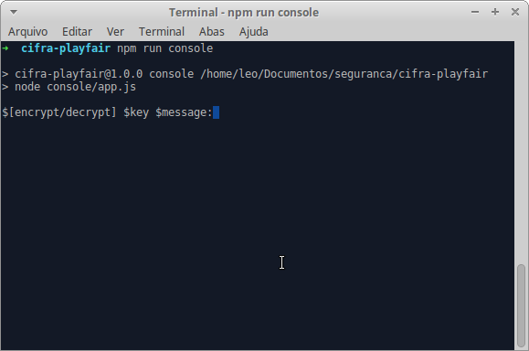

# Cifra de Playfair

## Relátorio

Eu resolvi a o exercício proposto individualmente. Para implementação dessa cifra optei por utilizar a linguagem javascript devido uma maior afinidade que eu possuo com a mesma. O código de criptografar e descriptografar está localizado no diretório `lib`.  

## Instalar Dependências

Execute `npm install` no diretório raiz do projeto para instalar todas as dependências.

## Executar Projeto

Execute `npm run console` no diretório raiz do projeto.

## Alfabeto Utilizado

*ABCDEFGHIJLMNOPQRSTUVWXYZ*