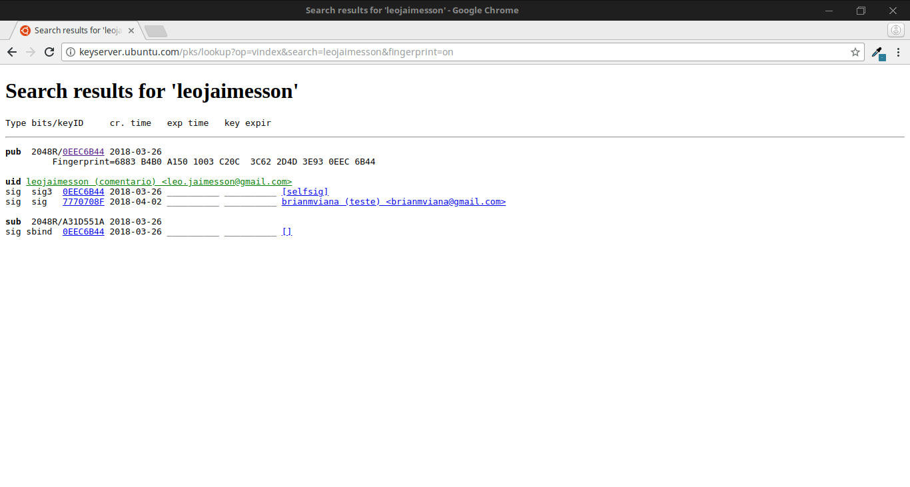

# Atividade GPG

## Relátorio

Foi feito tudo o que foi pedido. Aprendi a criptografar e assinar meus dados e comunicações. No inicio tive dificuldade em mandar a minha chave para o servidor, mas consegui com a ajuda dos meus colegas. Eu fiz essa atividade em conjunto com o aluno Brian Viana. No total gastei cerca de 3 horas e meia com a atividade.

