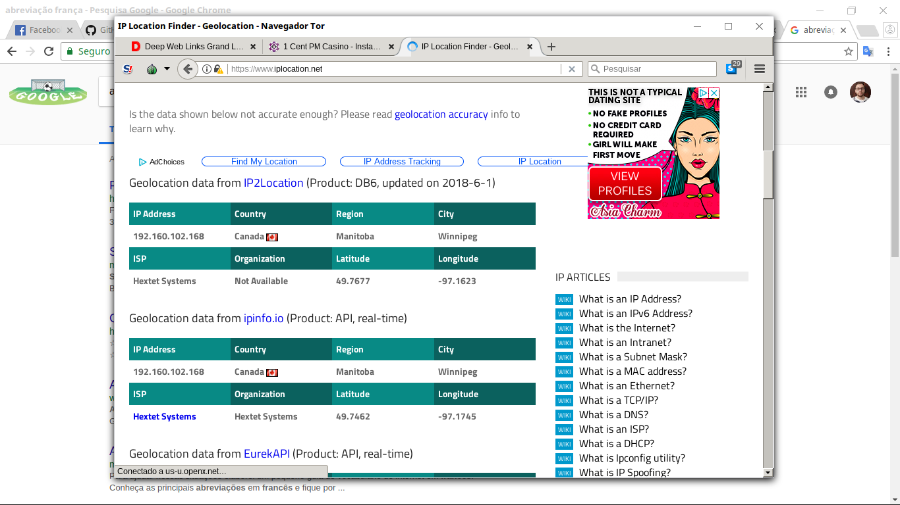

# Prática com TOR

Essa pratica foi bem interessante, pois mostra todo o poder presente nesse protocolo.

Após a instalação foi acessado um site da Deep Web usando o TOR Browser.


O arquivo 'torrc' foi modificado para inserir as restrições de países que não serão considerados como relays, ou seja, que serão ignorados como rota.

```
ExitNodes {br},{ug},{ie}, {fr}
```
---

Anonimato.


