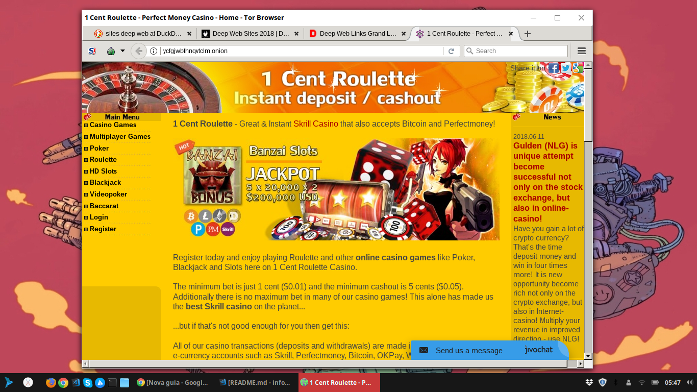

# Prática com TOR

Para realizar o tutorial proposto, foi preciso realizar a instalação do protocolo e do navegador TOR.

```console
sudo add-apt-repository ppa:webupd8team/tor-browser
sudo apt-get update
sudo apt-get install tor-browser
sudo apt-get install tor
```

---

Após a instalação foi acessado um site da Deep Web usando o TOR Browser.



O arquivo 'torrc' foi modificado para inserir as restrições de países que não serão considerados como relays, ou seja, que serão ignorados como rota.

```
ExitNodes {br},{ug},{ie}, {fr}
```
---

Anonimato.


