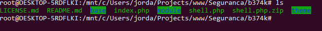
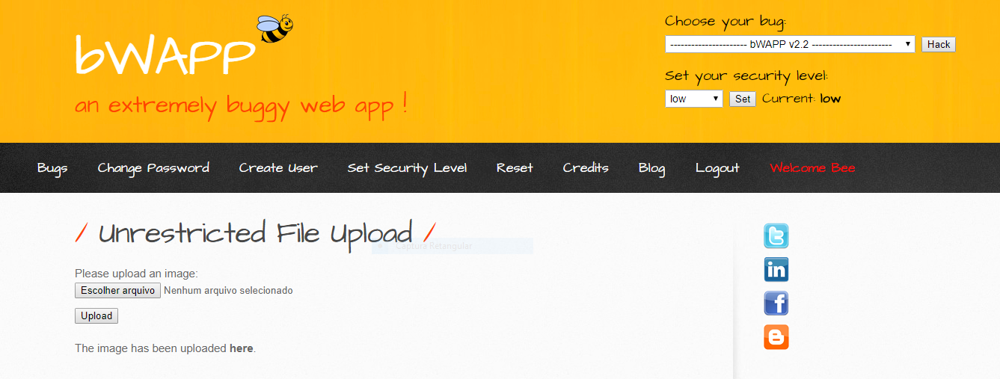
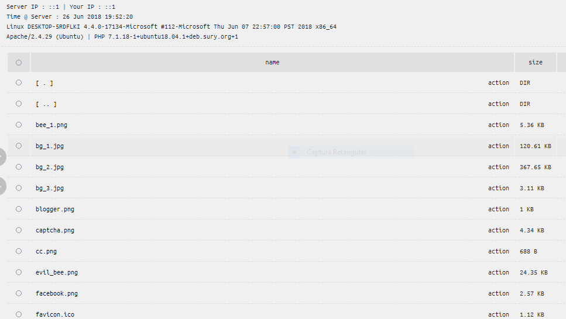
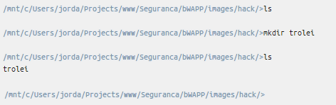

## Remote File Inclusion

Essa atividade foi bem interessante, pois é um ataque com pontencial devastador. Já que muitos desenvolvedores normalmente não se preucupam em verificar a inclusão de ficheiros externos em suas aplicações. Com essa pratica eu consegui aprender um pouco sobre ambas as ferramentas.

Eu tive algumas complicações em relação a configuração da maquina. Só que o jordão fez o favor de disponibilizar sua maquina para eu fazer a prática.

---

---

---

---

