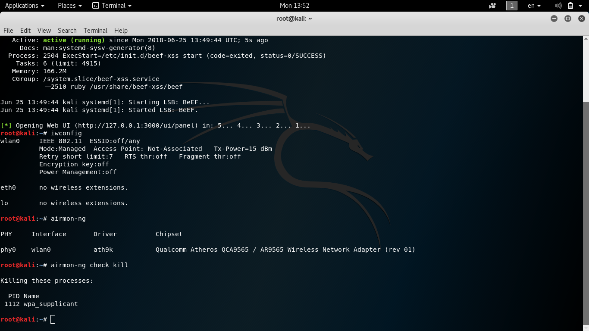
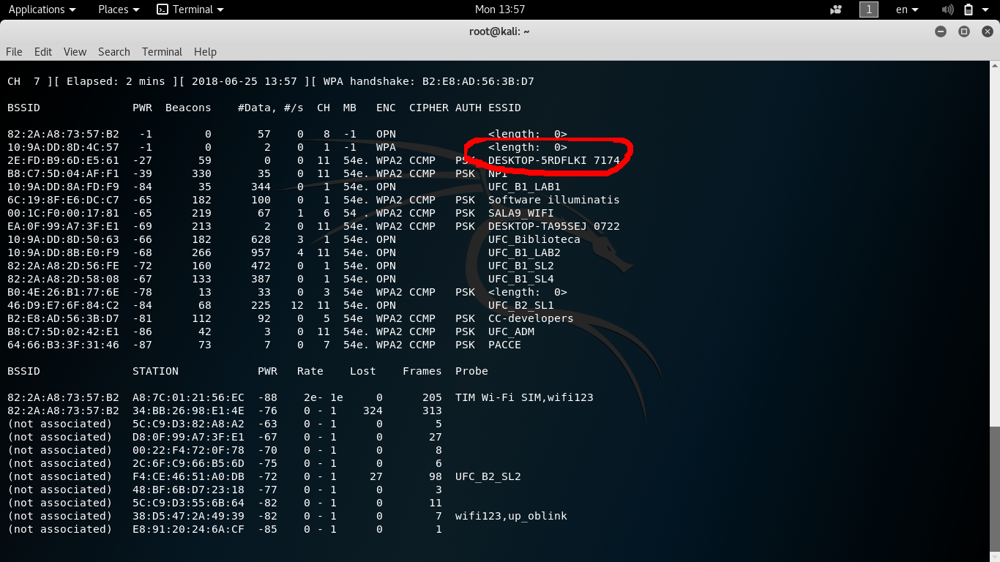
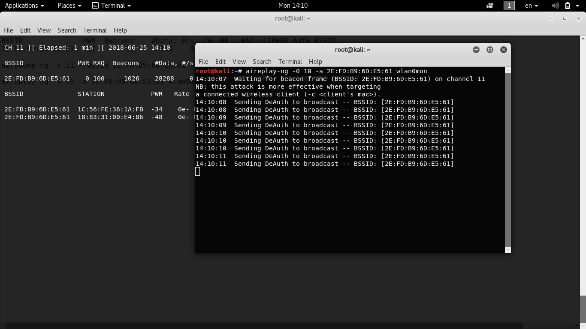

Nessa atividade aprendi a utilizar o kali linux para invadir e obter a senha WiFi de dispositivos Wireless. Eu consegui aprender alguns conceitos basicos de redes no processo.

Fiz com o Jordão.

---

---

---

---

